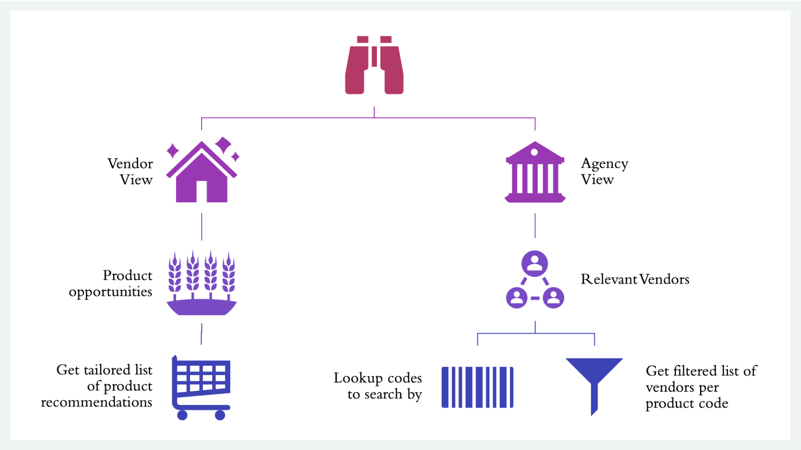
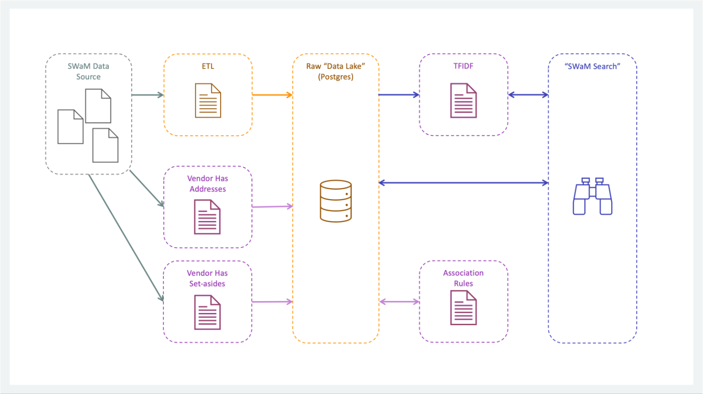
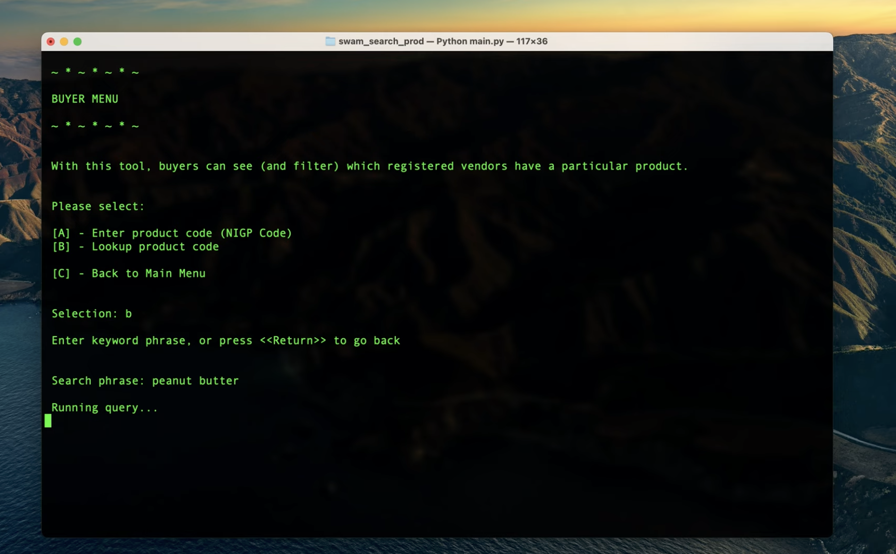
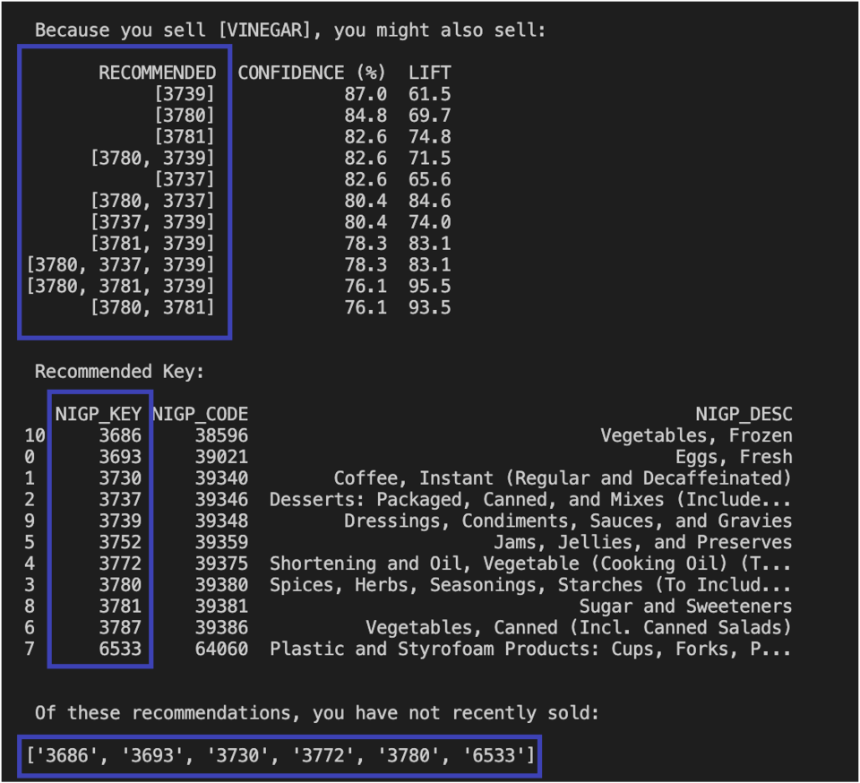
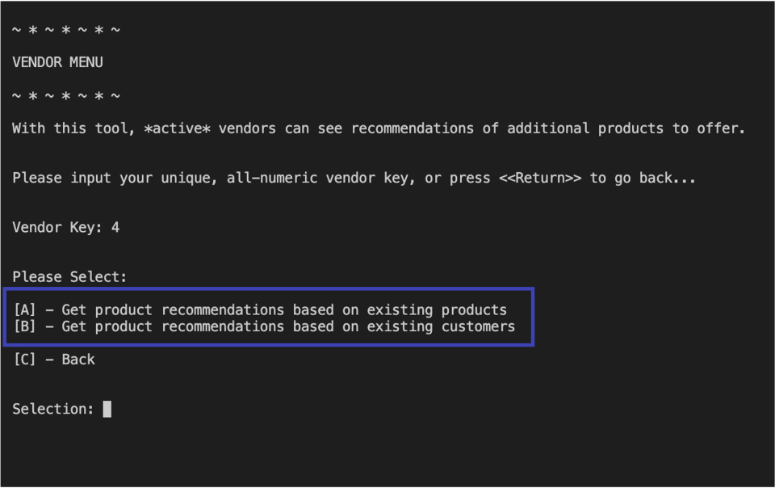

# SWaM Search #

## Introduction ##

The [Virginia Department of Small Business and Supplier Diversity (DSBSD)](https://www.sbsd.virginia.gov/) maintains the SWaM program, which seeks to increase the support and opportunity for traditionally disadvantaged business owners.  Businesses may participate as suppliers in this programme by applying for one or more set-aside certifications, such as “woman-owned”, “minority-owned”, “veteran-owned”, “disabled veteran-owned”, "small business", and “micro” small business.

In 2014, Virginia governor McAuliffe issued an [executive order (EO20)](https://www.sbsd.virginia.gov/wp-content/uploads/2018/10/SWaM-EO20_2014.pdf) establishing the target of awarding over 42% of its discretionary spending to DSBSD-certified small businesses.  As a result, state agencies are now accountable for planning and assuring that a greater part of their respective spending is distributed on a race- and gender-neutral basis.

A diverse network of relevant suppliers available to partner with Virginia agencies is integral to both the state-wide achievement of and agency-level achievements of diversity-spend targets.  The transactional data captured by the SWaM program supports insights that can improve the alignment of supplier-products to buyer-demand.

> Our proposed "SWaM Search" tool demonstrates how this transactional data may be leveraged to deliver key insights both to buyers and to vendors, thus supporting the increased relevance of the SWaM program participation with respect to participants' operational strategies.

## Cui Bono (Who Benefits)? ##

By providing a "Buyer" interface, the utility of the SWaM program data may be leveraged by non-government agencies, and thus expand access to the SWaM Vendor Network across all enterprises. 

By providing a "Vendor" interface, backed by statistical algorithms, vendor participants may improve the alignment of current and future product offerings to existing demand patterns, thus enabling better return on the investment of the time that it takes to certify and participate as SWaM Vendors. 

Together, these benefits support the heart of the governor's directive to diversify spend in ways that justly, and more-directly empower local communities.

## Features Overview ##
Currently, the "SWaM Search" tool delivers three features supporting two use cases:



| Vendor Use Case | Buyer Use Case |
|-----------|------------|
| In this use case, vendors can log in to view recommendations of what else to sell based on their transactions history.  The vendor selects one of two basket aggregation options from which to receive recommendations.  The top recommendations (max of 10) are generated for each product in their history, along with their confidence and lift metrics.  The vendor also receives a summary list of all recommended products *not* found in their transactions history. | In this use case, buyers can log in to research which vendors are available to provide a given product.  In the first feature, buyers enter a product code, then select the filters to apply (or not) to the returning list of vendors who have previously sold that product with the given product value found in their transaction history.  The second feature enables the buyer to look up an unknown NIGP product code from a simple keyword query. |
| ```Technical Note: This feature is supported by an *a priori* algorithm, which leverages the past 5 years of transactional data to generate product recommendations.  The results of running this statistical model are populated as two tables within the backend database.  After the vendor enters their Vendor Key, the app queries the database to return a list of unique products from that vendor's transactions.  After selecting a basket aggregation (by order or by agency) the app then queries the respective results table for the top 10 product associations, sorted by confidence, then lift.``` | ```Technical Note: The code-lookup feature leverages a TFIDF model to measure the cosine similarity of the keyword query against the product descriptions in the product table and return likely matches above a given threshold. The filtered reporting feature leverages relatively simple SQL queries to return filtered lists of vendors.``` |

## Underlying Architecture ##



| Storage & ETL | Analytic Models | Application | 
|-----------|------------|------------|
| For this demo, the source data took the form of .csv flat files.  The application leverages Postgres to centralize and store the data in queriable tables.  Several pre-processing scripts format the data prior to its import into the data lake. | From the transactions data, we built two a priori models, which we ran in Google Collab.  We then stored the results as tables within our Postgres data "lake". </br></br> In the case of the product-code lookup feature, the TFIDF model runs within the app to deliver recommendations per the user's keyword search. | The queries are designed to minimise the cost of the search by selecting only the data that is needed to deliver the report. |
| ```Technical Note: In a cloud environment, these scripts would ideally leverage serverless computing that could be triggered during the ETL process.  Instead of storing source data in relational tables, the cloud architecture could instead leverage the compressed storage of parquet files.``` | ```Technical Note:  Because the *a priori* models are compute intensive, this process could be repeated at set intervals, such as quarterly or semi-annually.``` | ```Technical Note:  At start-up, the application calls and loads the master products table from the data lake.  All following data queries are called by the application as specific, filtered subsets.``` |

## Demo (~ 00:04:25) ##

[](https://youtu.be/OeYxto9fL1Q)

## Next Steps ##

There are two improvement opportunities that we recommend to the design of the "Swam Search" utility:

| (1) Change to Vendor Side to Use Product Code |  |
|-----------|------------------------|
|Because this application was developed as several separate modules, we ran our association analysis using Product Keys.  Therefore, all of the association rules reference Product Key. The Product Code has meaning outside of the SWaM Program, whereas the Product Key is a primary identifier within the DSBSD's transactional system.  Modifying the process to use Product Code instead of Product Key would enable a more consistent and friendly user experience supporting additional features, such as ad-hoc recommendations by product code (as currently demonstrated on the Buyer side). |  |

| (2) Drop the Basket Aggregation based on Agency Option |  |
|-----------|------------------------|
| The basket aggregation based on products sold per order enables a filtered search based on single product entries, whereas the much larger aggregation of all products sold by an agency relies upon set lookups.  Each product search thus takes longer to execute, and fewer matches to individual products are returned. From the user's perspective, the results of this model are unproductive.  A more valuable menu option to the vendor may be to duplicate the feature provided on the buyer side that would enable looking up and querying product recommendations for a supplied Product Code, irrespective of the vendor's history. |  |